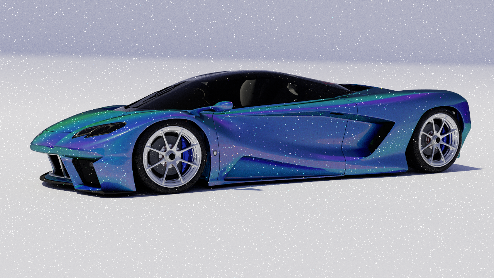
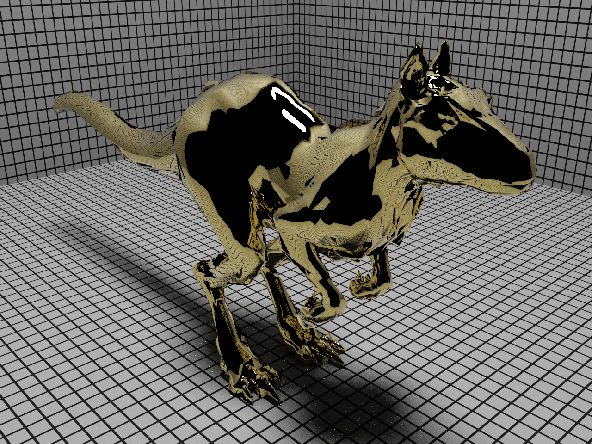
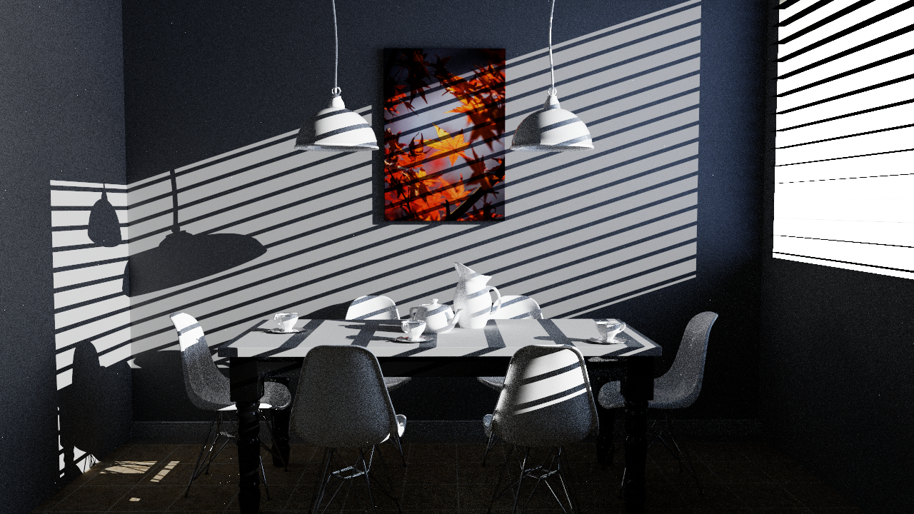
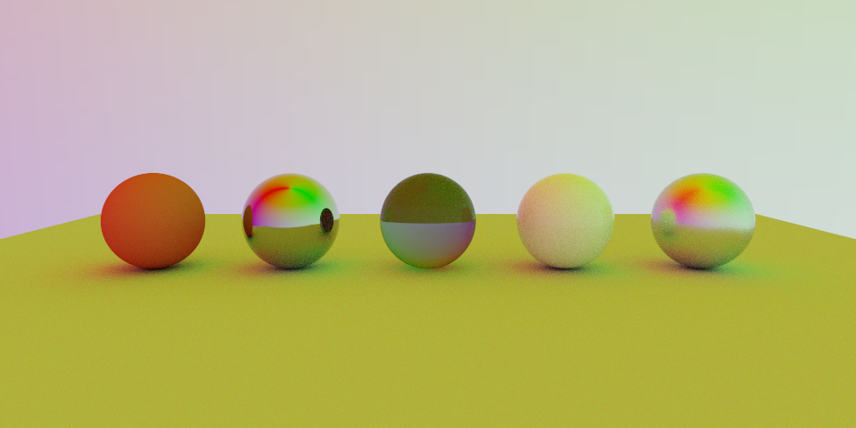

# YaoRay

**A physically based offline path tracer that consumes PBRT v4 scenes and renders them on a multi-threaded CPU backend** — with faithful, from-scratch implementations of advanced light-transport and material models (stochastic layered BSDFs, tabulated measured BRDFs, and separable subsurface scattering), each validated against the original papers and real PBRT v4 reference scenes.

C++20 · CMake/Ninja · multi-threaded · SAH BVH · MIS · RGB

<p align="center">
  <br>
  <sub><b>Measured BRDF</b> — a faithful port of Dupuy &amp; Jakob 2018 tabulated BRDFs renders the iridescent measured car paint of mmp's <code>sportscar</code> scene (data-driven importance sampling, spectral→RGB).</sub>
</p>

<table>
  <tr>
    <td width="33%"><br><sub><b>Subsurface scattering</b> — separable tabulated BSSRDF (Habel et al. photon beam diffusion) on the <code>sssdragon</code> "Skin1" medium.</sub></td>
    <td width="33%"><br><sub><b>Layered material</b> — stochastic two-layer BSDF (Guo et al. 2018): a smooth dielectric coat over a gold conductor base.</sub></td>
    <td width="33%"><br><sub><b>Layered BSDF sweep</b> — coated-diffuse and coated-conductor spheres with Beer–Lambert coat absorption.</sub></td>
  </tr>
  <tr>
    <td width="33%"><br><sub><b>SAH BVH + IBL</b> — mmp's Barcelona Pavilion: parallel SAH BVH, glass/metal, HDRI environment lighting.</sub></td>
    <td width="33%"><br><sub><b>Global illumination</b> — Bitterli's dining-room: MIS path tracing, area + window lighting, textures.</sub></td>
    <td width="33%"><br><sub><b>Core BSDFs</b> — diffuse, conductor, dielectric, thin-dielectric and measured materials under one HDRI.</sub></td>
  </tr>
</table>

---

## What it does

YaoRay parses a `.pbrt` v4 scene into a faithful AST, compiles it to a flat render-scene representation, and ray-traces it with a production-style CPU path tracer. The emphasis throughout is **correctness you can verify** — every advanced feature is reproduced from its source paper and checked with unit tests (energy conservation / white-furnace, normalization, MIS consistency, sampler↔pdf agreement) *and* against the matching PBRT v4 reference scene.

### Light transport
- Multi-threaded path tracer with **multiple importance sampling** across BSDF, area-light, and environment-light strategies.
- Independent, stratified, nested Owen-scrambled Sobol, and Z-ordered Sobol samplers use explicit semantic sample dimensions, so adding one random decision does not perturb unrelated paths.
- Optional deterministic adaptive sampling uses per-pixel Welford variance and absolute/relative standard-error stopping, compacting active pixels in a stable order between complete sample passes.
- Analytic and emissive lights use power-weighted alias tables; scenes with many local analytic lights additionally use a spatial light tree.
- **SAH-binned BVH** (12 buckets) with deterministic, parallel top-down construction; compact 32-byte binary nodes, precomputed ray slab data, near-first traversal, and an opt-in portable BVH4 SoA experiment are covered by equivalence tests.
- Russian-roulette termination; ACES / Reinhard / identity tone mapping; HDRI environment importance sampling.

### Reconstruction and output
- Camera ray differentials feed texture footprints; image textures build cached mip pyramids and support trilinear and anisotropic EWA filtering.
- Film accumulates beauty plus first-hit albedo, shading normal, and depth AOVs, including non-uniform adaptive sample counts in checkpoint version 3.
- An optional Open Image Denoise boundary accepts beauty/albedo/normal buffers when YaoRay is configured with `-DYAORAY_ENABLE_OIDN=ON`; the default build remains dependency-free.

### Materials (all real, not aliased)
- **Core BSDFs:** diffuse, conductor/metal (GGX), dielectric/glass, thin-dielectric, diffuse-transmission.
- **Layered (`coateddiffuse` / `coatedconductor`):** a stochastic position-free two-layer walk (Guo et al. 2018) — rough dielectric coat + Beer–Lambert absorbing medium + diffuse/conductor base, with MIS-consistent `sample`/`f`/`pdf`.
- **Measured (`measured`):** a faithful port of Dupuy & Jakob 2018 `.bsdf` tensor files — `PiecewiseLinear2D` warps, two-stage luminance→VNDF importance sampling, spectral→RGB.
- **Subsurface (`subsurface`):** a separable tabulated BSSRDF driven by a photon beam diffusion profile, with probe-ray exit-point sampling integrated into the path tracer; direct `sigma_a`/`sigma_s` and the `Skin1` preset.

### Frontend
- PBRT v4 `trianglemesh` / `plymesh` (ASCII, little- and **big-endian** binary) / `sphere`; `imagemap` textures (PNG/JPEG/TGA/BMP/HDR/PFM/**EXR**) + normal maps; point / distant / spot / area / `infinite` (HDRI) lights.
- A documented **graceful-degradation policy**: unsupported directives emit a named Warning and fall back to the nearest supported behavior rather than failing.

## Status

**Milestones M1–M4 complete** (380 unit tests + CTest scene-render gates). The current Release baseline is fully green: all unit, CLI, and smoke-render checks pass. M5 is stabilizing the CPU architecture and profiling from that deterministic baseline.

| Milestone | Headline | Anchor scene |
|---|---|---|
| **M1** | PBRT v4 frontend + core BSDFs + textures | cornell / material-studio / dining-room |
| **M2** | SAH BVH + parallel build | Barcelona Pavilion |
| **M3** | Advanced Materials I: stochastic layered + Dupuy–Jakob measured | killeroo-coated · sportscar |
| **M4** | Subsurface scattering (separable tabulated BSSRDF) | sssdragon |
| **M5** | CPU architecture stabilization, green test baseline, and profiling | *in progress* |

North Star: a correct, understandable, and well-profiled CPU renderer with broad PBRT v4 scene coverage. GPU/CUDA work is deferred.

## Build

```bash
# Configure once with an optimized build type (important: Ninja ignores --config).
cmake -S . -B build -DBUILD_TESTING=ON -DCMAKE_BUILD_TYPE=Release
cmake --build build
ctest --test-dir build --output-on-failure
```
On Windows with a multi-config generator, use `--config Release` on the build/test commands instead.

Correctness, integration/smoke rendering, and opt-in performance measurements are intentionally separate. Performance cases are executable benchmarks rather than CTest pass/fail gates:

```bash
cmake -S . -B build -DBUILD_TESTING=ON \
  -DYAORAY_BUILD_PERFORMANCE_TESTS=ON -DCMAKE_BUILD_TYPE=Release
cmake --build build --target yaoray_cpu_benchmark
./build/benchmarks/yaoray_cpu_benchmark --repeat 3 \
  --output /tmp/yaoray_cpu_benchmark.jsonl
```

The fixed `small`, `medium`, and `large` cases record total preparation and acceleration-build time, render time, rays/s, BVH node/triangle/sphere tests, flat/two-level acceleration kind, BVH size/depth, BLAS/TLAS counts, sampler, worker count, peak resident memory, and split-seed RMSE. Use `--case small|medium|large` for a focused run. The second seed used for the noise estimate is excluded from the primary render timing.

For optimization A/B tests, use the same Release binary, machine load, case, thread count, sampler, seed, and compiler. Run one unrecorded warm-up followed by at least five repetitions, compare medians rather than the fastest sample, and keep both work counters and image error beside wall time. For example:

```bash
./build/benchmarks/yaoray_cpu_benchmark --case medium --repeat 5 \
  --threads 8 --sampler sobol --output /tmp/baseline.jsonl
```

Change one variable, rebuild, and write a second JSONL file. A time reduction with unchanged rays, primitive-test counts, and RMSE usually identifies lower per-operation overhead; reduced primitive tests points to acceleration or ordering; reduced rays points to sampling or transport policy. Always run CTest after the comparison so a faster result cannot hide a changed image or traversal decision.

## Run

```bash
./build/yaoray render scenes/pbrt/material_studio/material_studio.pbrt --backend cpu
./build/yaoray render scenes/pbrt/cornell_box_pbrt/cornell_box_pbrt.pbrt --backend cpu
./build/yaoray render scenes/pbrt/coated_showcase/coated_showcase.pbrt --backend cpu
```
(On Windows: `build\Release\yaoray.exe render ...`.) The output image lands at the path in the scene's `Film "string filename"` directive.

## Showcase scenes

The first group is committed and exercised by CTest; the rest are large third-party PBRT v4 assets under permissive licenses, linked via per-scene download workflows (Git LFS, gitignored) rather than redistributed.

| Scene | Demonstrates |
|---|---|
| `scenes/pbrt/cornell_box_pbrt/` | Spheres + point light + mirror/glass — the classic. |
| `scenes/pbrt/material_studio/` | Every core BSDF on a row of spheres under an HDRI. |
| `scenes/pbrt/coated_showcase/` | Layered `coateddiffuse` / `coatedconductor`. |
| `scenes/pbrt/texture_test/` | Texture wrap modes + normal-map path. |
| `scenes/pbrt/dining_room/` | Bitterli's dining-room — global illumination. |
| `scenes/pbrt/barcelona_pavilion/` | mmp's Barcelona Pavilion — SAH BVH + IBL (M2 anchor). |
| `scenes/pbrt/killeroo_coated/` | mmp's killeroo — layered gold coat (M3 anchor). |
| `scenes/pbrt/sportscar/` | mmp's sportscar — measured iridescent paint (M3 anchor). |
| `scenes/pbrt/sssdragon/` | mmp's sssdragon — subsurface scattering (M4 anchor). |

Large reference assets come from [pbrt-v4-scenes](https://github.com/mmp/pbrt-v4-scenes) and [Benedikt Bitterli's rendering resources](https://benedikt-bitterli.me/resources/). Clone or extract them under the gitignored `external/assets/pbrt/` tree. The official PBRT repository uses Git LFS, so sparse checkout is recommended when fetching only `barcelona-pavilion`, `killeroos`, `sportscar`, or `sssdragon`. The compressed sssdragon PLY must be decompressed before use because YaoRay reads binary big-endian PLY but does not transparently decode gzip.

## Architecture

```
PBRT v4 scene  ──CompilePbrtScene──▶  RenderSceneIR + RenderSettings
   (.pbrt)                              │ canonical data   │ per-run policy
                                        └────── RenderJob ──┘
                                                   │ Backend.Prepare
                                                   ▼
                           CpuPreparedScene (scene + acceleration + worker pool)
                                                   │
                                  Geometry / Shading / Light scene views
```

The PBRT frontend parses `.pbrt` files into `PbrtScene`, then compiles canonical scene tables and per-render settings separately. `RenderJob` combines them for one execution. The CPU backend builds a `CpuPreparedScene` containing the job, its prepared BVH, and a persistent `std::jthread` worker pool. A render request can carry a `std::stop_token`; the path tracer only commits complete sample passes so cancellation cannot leave different pixels with different sample counts. Generic sampling, shading, lighting, and path-transport code remain outside the backend.

Hot-path consumers receive narrow non-owning views instead of the full scene aggregate: `GeometryView` exposes vertex/index/primitive/sphere spans, while `ShadingSceneView` and `LightSceneView` expose only their relevant tables. Stable cross-table identities use typed handles. A configure-time public-header dependency check guards the intended inward module graph.

Acceleration selection is explicit. Scenes without mesh instances use the flat built-in SAH BVH as the correctness/performance reference. PBRT object instances containing ordinary triangle, PLY, disk, or base-loopsubdiv meshes compile one immutable primitive and reuse its BLAS from transformed TLAS instances; analytic spheres, emissive meshes, and subsurface meshes currently stay on the correctness-first flattened path. Instances and analytic spheres share the SAH TLAS. Transform-only edits can refit TLAS bounds without changing topology, while an explicit rebuild recomputes TLAS SAH topology and retains the BLASes.

### Module boundaries

| Module | Responsibility |
|---|---|
| `core` | Dependency-light vectors, bounds, rays, transforms, RNG, and version utilities. |
| `io` | External byte formats: image decoding, PLY, tensor files, and asset access. |
| `frontend/pbrt` | PBRT parsing, source representation, validation, degradation, and scene compilation. |
| `scene` | Canonical format-neutral scene contracts, typed handles, camera, render settings, hashes, and diagnostics. |
| `geometry` | Primitive intersection and surface-hit construction over scene geometry views. |
| `accel` | Unified triangle/sphere BVH input preparation, split policy, serial/parallel construction, and traversal. |
| `sampling` | Deterministic sample streams, seed derivation, dimensions, and sampling strategies. |
| `shading` | Texture sampling, material evaluation, BSDF/BSSRDF, and measured material data. |
| `lighting` | Light/environment representation, evaluation, selection, and importance sampling. |
| `integrators` | Path transport, direct lighting, MIS, surface queries, and BSSRDF probing. |
| `runtime` | `RenderJob`, backend lifecycle, progress/results, capabilities, and frozen CUDA stubs. |
| `backends/cpu` | CPU preparation, tile/thread scheduling, and integrator execution. |
| `film` | Sample accumulation, checkpoints, tone mapping, and image output. |
| `app` | CLI composition root only. |

The public `include/yaoray`, implementation `src`, and `tests` trees mirror these modules. Each source module owns a local `CMakeLists.txt`; the root build file only composes modules and concrete backends. A type is placed by its semantics rather than by the first implementation that uses it—therefore Sampler is not a CPU type, Material is not a backend type, and render resolution is not scene data.

The canonical dependency rule is inward: `core` knows nothing about scenes or rendering policy; `scene` depends only on `core` and its own contracts; frontend and app depend on the renderer, never the reverse; integrators do not parse files or encode images; CPU backend code only prepares and executes generic rendering components. CUDA/GPU development is intentionally deferred. The built-in SAH builder remains the correctness/reference path as later acceleration variants are added.

### Repository documentation

The repository intentionally maintains only two Markdown documents:

- `README.md` is the user-facing feature, build, architecture, scene, and learning reference.
- `AGENTS.md` is the contributor/automation contract for boundaries, hygiene, testing, and code style.

Implementation plans, historical specs, per-scene notes, and generated reports are not maintained as parallel sources of truth. Showcase images live under `media/showcase/`, not under a documentation tree.

This project is a clean-architecture rewrite of an earlier experiment (`ToyRender`), preserved on the `archive/toyrender-before-yaoray` branch.

## Learning resources

For renderer architecture and algorithms, start with [Physically Based Rendering, 4th edition](https://www.pbr-book.org/4ed/Introduction/pbrt_System_Overview) and compare its Camera, Sampler, Integrator, Primitive, Material, Light, and Film boundaries with YaoRay. The [pbrt-v4 source](https://github.com/mmp/pbrt-v4) is the closest production reference for the implemented models.

For alternative architectures:

- [Mitsuba 3 developer guide](https://mitsuba.readthedocs.io/en/stable/src/developer_guide.html) demonstrates plugin-oriented rendering and backend variants.
- [Blender Cycles design goals](https://developer.blender.org/docs/features/cycles/design_goals/) and [kernel language](https://developer.blender.org/docs/features/cycles/kernel_language/) show how a production renderer constrains hot-path code across devices.
- [Embree API](https://www.embree.org/api.html) is a useful example of keeping acceleration and ray queries independent from shading and integration.
- [Data-Oriented Design](https://www.dataorienteddesign.com/dodbook/) is useful when evaluating flat tables, handles, AOS/SOA layouts, and cache behavior.

When studying any codebase, draw three different diagrams: build dependencies, runtime calls, and data ownership. They answer different questions; a clean directory tree alone does not prove clean ownership.

---

<sub>Reference scenes © their respective authors (Benedikt Bitterli; Matt Pharr / pbrt-v4-scenes), used under their original licenses for validation; not redistributed here. YaoRay is a personal learning/research renderer.</sub>
