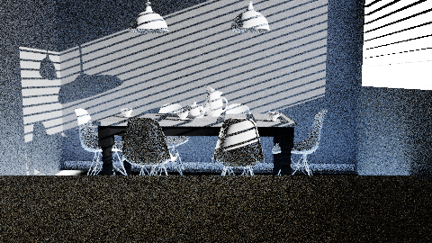

# YaoRay

YaoRay is a learning-oriented, engineering-grade offline path tracer focused on physically based rendering, clean architecture, and future CUDA acceleration. It consumes PBRT v4 scene files and produces HDR images via a multi-threaded CPU backend.

This repository is a rewrite of the previous ToyRender experiment. The old code is preserved on `archive/toyrender-before-yaoray`; the new project starts from a clean architecture.



*Bitterli's [dining-room](https://benedikt-bitterli.me/resources/) scene rendered with the M1 pipeline at 1280×720 / 64 spp / max-depth 65.*

## Current Status

M1, M2, and M3 are complete. M3 delivered real stochastic layered BSDFs (`coateddiffuse`/`coatedconductor`, killeroo-coated scene) and real Dupuy & Jakob 2018 measured BRDFs (isotropic; spectral→RGB; data-driven importance sampling, sportscar scene). M4 (subsurface scattering / CUDA per the roadmap) is next. The renderer handles:

- A two-layer pipeline: `PbrtScene → RenderSceneIR → Backend`.
- A multi-threaded CPU path tracer with SAH-binned BVH (parallel construction, deterministic), MIS over BSDF / area-light / environment samples, Russian-roulette termination, ACES/Reinhard/identity tone mapping, and PNG output.
- Real PBRT v4 scenes including Benedikt Bitterli's CC-BY dining-room and Matt Pharr's Barcelona Pavilion (see the [showcase](#showcase-scenes) below).

See `docs/architecture/overview.md` for the supported PBRT v4 directive surface and what's planned for M2+.

## Build

macOS/Linux:

```bash
cmake -S . -B build -DBUILD_TESTING=ON
cmake --build build
ctest --test-dir build --output-on-failure
```

Windows:

```powershell
cmake -S . -B build -DBUILD_TESTING=ON
cmake --build build --config Release
ctest --test-dir build --output-on-failure -C Release
```

## Run

After building, render any of the bundled showcase scenes:

macOS/Linux:

```bash
./build/yaoray --help
./build/yaoray --version
./build/yaoray render scenes/pbrt/hello_emissive/hello_emissive.pbrt --backend cpu
./build/yaoray render scenes/pbrt/cornell_box_pbrt/cornell_box_pbrt.pbrt --backend cpu
./build/yaoray render scenes/pbrt/material_studio/material_studio.pbrt --backend cpu
./build/yaoray render scenes/pbrt/texture_test/texture_test.pbrt --backend cpu
```

Windows:

```powershell
build\Release\yaoray.exe --help
build\Release\yaoray.exe --version
build\Release\yaoray.exe render scenes\pbrt\hello_emissive\hello_emissive.pbrt --backend cpu
build\Release\yaoray.exe render scenes\pbrt\cornell_box_pbrt\cornell_box_pbrt.pbrt --backend cpu
build\Release\yaoray.exe render scenes\pbrt\material_studio\material_studio.pbrt --backend cpu
build\Release\yaoray.exe render scenes\pbrt\texture_test\texture_test.pbrt --backend cpu
```

The output PNG lands at the path declared in the scene's `Film "string filename"` directive (typically inside an `out/` directory next to the scene file).

## Showcase Scenes

| Scene | Purpose |
|---|---|
| `scenes/pbrt/hello_emissive/` | Smallest end-to-end demo: trianglemesh + area light. |
| `scenes/pbrt/cornell_box_pbrt/` | `Shape "sphere"` + `LightSource "point"` + classic mirror/glass spheres. |
| `scenes/pbrt/material_studio/` | HDRI environment + each supported BSDF on a row of spheres. |
| `scenes/pbrt/texture_test/` | Texture wrap modes + normal-map data path validation. |
| `scenes/pbrt/dining_room/` | Bitterli's PBRT v4 dining-room (asset downloaded separately; see the per-scene README for the curl/unzip workflow). |
| `scenes/pbrt/barcelona_pavilion/` | mmp's PBRT v4 Barcelona Pavilion — M2 anchor scene (asset downloaded separately via `git lfs`; see the per-scene README for the sparse-checkout workflow). |
| `scenes/pbrt/killeroo_coated/` | mmp's PBRT v4 killeroo-coated — M3 layered-materials anchor (asset via `git lfs`; see the per-scene README). |
| `scenes/pbrt/sportscar/` | mmp's PBRT v4 sportscar — M3 measured-BRDF anchor (asset via `git lfs`; see the per-scene README). |

## Architecture

```
PBRT v4 scene  ──CompilePbrtScene──▶  RenderSceneIR  ──Backend.Prepare──▶  Renderable
   (.pbrt)                              (flat tables)                       (BVH + buffers)
```

The PBRT layer parses `.pbrt` files into `PbrtScene`. The render layer compiles that into `RenderSceneIR` — a flat, GPU-friendly layout with indexed vertices, primitives, materials, textures, and lights. The CPU backend prepares the IR into a `CpuPreparedScene` (BVH + texture cache + light distributions); a future CUDA backend will plug into the same two-stage interface.

See `docs/architecture/overview.md` for the complete supported PBRT v4 surface, the documented material degradation policy, and the M2+ roadmap.
