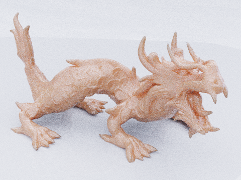
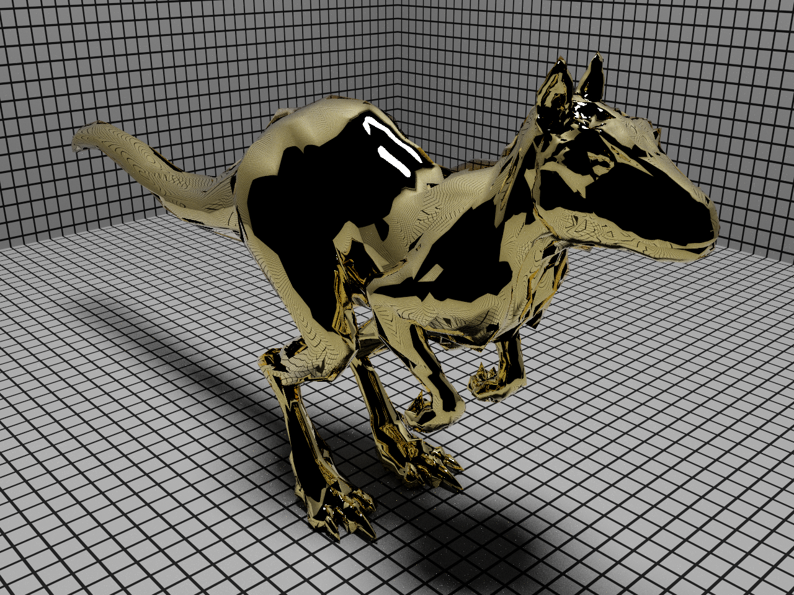
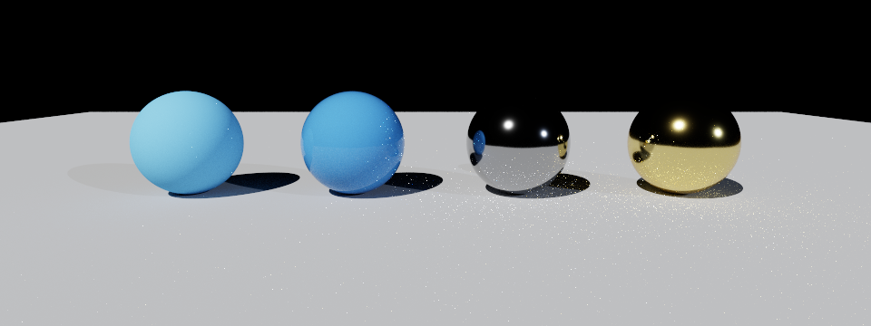
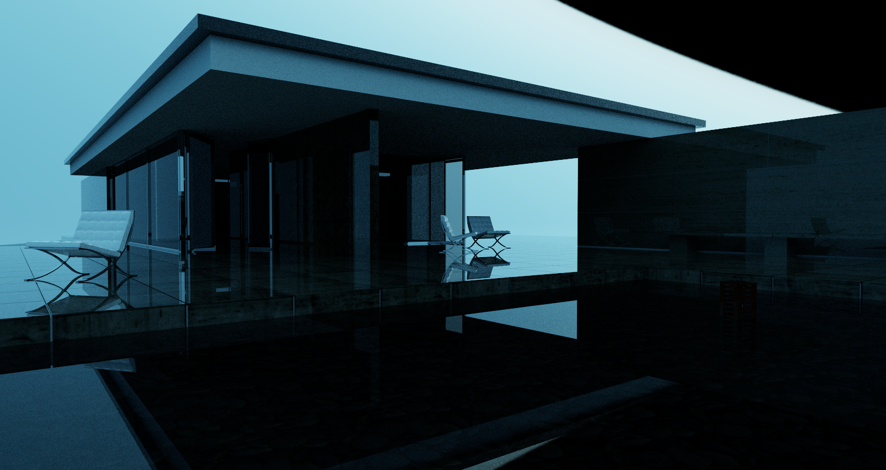

# YaoRay

**A physically based offline path tracer that consumes PBRT v4 scenes and renders them on a multi-threaded CPU backend** — with faithful, from-scratch implementations of advanced light-transport and material models (stochastic layered BSDFs, tabulated measured BRDFs, and separable subsurface scattering), each validated against the original papers and real PBRT v4 reference scenes.

C++20 · CMake/Ninja · multi-threaded · SAH BVH · MIS · RGB

<p align="center">
  <br>
  <sub><b>Measured BRDF</b> — a faithful port of Dupuy &amp; Jakob 2018 tabulated BRDFs renders the iridescent measured car paint of mmp's <code>sportscar</code> scene (data-driven importance sampling, spectral→RGB).</sub>
</p>

<table>
  <tr>
    <td width="33%"><br><sub><b>Subsurface scattering</b> — separable tabulated BSSRDF (Habel et al. photon beam diffusion) on the <code>sssdragon</code> "Skin1" medium.</sub></td>
    <td width="33%"><br><sub><b>Layered material</b> — stochastic two-layer BSDF (Guo et al. 2018): a smooth dielectric coat over a gold conductor base.</sub></td>
    <td width="33%"><br><sub><b>Layered BSDF sweep</b> — coated-diffuse and coated-conductor spheres with Beer–Lambert coat absorption.</sub></td>
  </tr>
  <tr>
    <td width="33%"><br><sub><b>SAH BVH + IBL</b> — mmp's Barcelona Pavilion: parallel SAH BVH, glass/metal, HDRI environment lighting.</sub></td>
    <td width="33%"><br><sub><b>Global illumination</b> — Bitterli's dining-room: MIS path tracing, area + window lighting, textures.</sub></td>
    <td width="33%"><br><sub><b>Core BSDFs</b> — diffuse, conductor, dielectric, thin-dielectric and measured materials under one HDRI.</sub></td>
  </tr>
</table>

---

## What it does

YaoRay parses a `.pbrt` v4 scene into a faithful AST, compiles it to a flat, GPU-friendly intermediate representation, and ray-traces it with a production-style CPU path tracer. The emphasis throughout is **correctness you can verify** — every advanced feature is reproduced from its source paper and checked with unit tests (energy conservation / white-furnace, normalization, MIS consistency, sampler↔pdf agreement) *and* against the matching PBRT v4 reference scene.

### Light transport
- Multi-threaded path tracer with **multiple importance sampling** across BSDF, area-light, and environment-light strategies.
- **SAH-binned BVH** (12 buckets) with deterministic, parallel top-down construction.
- Russian-roulette termination; ACES / Reinhard / identity tone mapping; HDRI environment importance sampling.

### Materials (all real, not aliased)
- **Core BSDFs:** diffuse, conductor/metal (GGX), dielectric/glass, thin-dielectric, diffuse-transmission.
- **Layered (`coateddiffuse` / `coatedconductor`):** a stochastic position-free two-layer walk (Guo et al. 2018) — rough dielectric coat + Beer–Lambert absorbing medium + diffuse/conductor base, with MIS-consistent `sample`/`f`/`pdf`.
- **Measured (`measured`):** a faithful port of Dupuy & Jakob 2018 `.bsdf` tensor files — `PiecewiseLinear2D` warps, two-stage luminance→VNDF importance sampling, spectral→RGB.
- **Subsurface (`subsurface`):** a separable tabulated BSSRDF driven by a photon beam diffusion profile, with probe-ray exit-point sampling integrated into the path tracer; direct `sigma_a`/`sigma_s` and the `Skin1` preset.

### Frontend
- PBRT v4 `trianglemesh` / `plymesh` (ASCII, little- and **big-endian** binary) / `sphere`; `imagemap` textures (PNG/JPEG/TGA/BMP/HDR/PFM/**EXR**) + normal maps; point / distant / spot / area / `infinite` (HDRI) lights.
- A documented **graceful-degradation policy**: unsupported directives emit a named Warning and fall back to the nearest supported behavior rather than failing.

## Status

**Milestones M1–M4 complete** (≈340 unit tests + CTest scene-render gates, all green):

| Milestone | Headline | Anchor scene |
|---|---|---|
| **M1** | PBRT v4 frontend + core BSDFs + textures | cornell / material-studio / dining-room |
| **M2** | SAH BVH + parallel build | Barcelona Pavilion |
| **M3** | Advanced Materials I: stochastic layered + Dupuy–Jakob measured | killeroo-coated · sportscar |
| **M4** | Subsurface scattering (separable tabulated BSSRDF) | sssdragon |
| **M5** | CUDA backend (bit-for-bit GPU port of the frozen CPU surface) | *planned* |

North Star: complete PBRT v4 scene coverage on CPU, then port the frozen surface to CUDA.

## Build

```bash
# Configure once with an optimized build type (important: Ninja ignores --config).
cmake -S . -B build -DBUILD_TESTING=ON -DCMAKE_BUILD_TYPE=Release
cmake --build build
ctest --test-dir build --output-on-failure
```
On Windows with a multi-config generator, use `--config Release` on the build/test commands instead.

## Run

```bash
./build/yaoray render scenes/pbrt/material_studio/material_studio.pbrt --backend cpu
./build/yaoray render scenes/pbrt/cornell_box_pbrt/cornell_box_pbrt.pbrt --backend cpu
./build/yaoray render scenes/pbrt/coated_showcase/coated_showcase.pbrt --backend cpu
```
(On Windows: `build\Release\yaoray.exe render ...`.) The output image lands at the path in the scene's `Film "string filename"` directive.

## Showcase scenes

The first group is committed and exercised by CTest; the rest are large third-party PBRT v4 assets under permissive licenses, linked via per-scene download workflows (Git LFS, gitignored) rather than redistributed.

| Scene | Demonstrates |
|---|---|
| `scenes/pbrt/cornell_box_pbrt/` | Spheres + point light + mirror/glass — the classic. |
| `scenes/pbrt/material_studio/` | Every core BSDF on a row of spheres under an HDRI. |
| `scenes/pbrt/coated_showcase/` | Layered `coateddiffuse` / `coatedconductor`. |
| `scenes/pbrt/texture_test/` | Texture wrap modes + normal-map path. |
| `scenes/pbrt/dining_room/` | Bitterli's dining-room — global illumination. |
| `scenes/pbrt/barcelona_pavilion/` | mmp's Barcelona Pavilion — SAH BVH + IBL (M2 anchor). |
| `scenes/pbrt/killeroo_coated/` | mmp's killeroo — layered gold coat (M3 anchor). |
| `scenes/pbrt/sportscar/` | mmp's sportscar — measured iridescent paint (M3 anchor). |
| `scenes/pbrt/sssdragon/` | mmp's sssdragon — subsurface scattering (M4 anchor). |

## Architecture

```
PBRT v4 scene  ──CompilePbrtScene──▶  RenderSceneIR  ──Backend.Prepare──▶  Renderable
   (.pbrt)                              (flat tables)                       (BVH + buffers)
```

The PBRT layer parses `.pbrt` files into `PbrtScene`. The render layer compiles that into `RenderSceneIR` — a flat, GPU-friendly layout (indexed vertices, primitives, materials, textures, lights). The CPU backend prepares the IR into a `CpuPreparedScene` (BVH + texture cache + light distributions); a future CUDA backend plugs into the same two-stage interface.

See [`docs/architecture/overview.md`](docs/architecture/overview.md) for the complete supported PBRT v4 surface, the degradation policy, and the milestone roadmap. This project is a clean-architecture rewrite of an earlier experiment (`ToyRender`), preserved on the `archive/toyrender-before-yaoray` branch.

---

<sub>Reference scenes © their respective authors (Benedikt Bitterli; Matt Pharr / pbrt-v4-scenes), used under their original licenses for validation; not redistributed here. YaoRay is a personal learning/research renderer.</sub>
